# Pure Power Tactical Engine

Pure Power Tactical Engine (in short PPTactical) is a cross-platform 2D engine for real time strategy and real time tactics games.

The engine is currently frozen for major features and development, however, it's still maintained to fix minor issues and keep it up to date with compilation.

## History

The project began as the closed source engine of the first game developed by Piron Games, called [Pure Power](https://www.pirongames.com/games/ppower/ppower.htm) (1998-2001)

The engine was released as open-source and has been under steady development until its latest stable release, version 0.9.6 (2001-2006)

Previous releases of the engine may be found at https://sourceforge.net/projects/pptactical/

A detailed history of the project may be found in [doc/PPT Releases.doc](doc/PPT%20Releases.doc)

## Setup

### General
This project uses submodules and they need to be initialized. 

After cloning the project, run:

```
git submodule init
git submodule update
```

Alternatively, pass --recurse-submodules to git clone (or tick the box in your clone popup if you have a visual git client).

### Building The Engine

A C++ compiler:
* the engine has been tested using [mingw64](https://www.mingw-w64.org/) and x86_64-w64 architecture

SDL 2:
* make sure you use the libraries compatible with the compiler;
* tested with [SDL2-2.30.11 x64](https://github.com/libsdl-org/SDL/releases/tag/release-2.30.11);
* unpack into [lib](lib/) folder or, if you have it installed, adjust the paths to your installation.

Code::Blocks (optional):
* a project is available in [dev/codeblocks/engine_sdl](dev/codeblocks/engine_sdl/)
* go to Settings -> Compiler -> Global Compiler Settings -> Toolchain executables and set the path to the C++ compiler you're planning to use.

The engine should build and run on all major platforms where SDL is supported (Windows, Linux, Unix, etc).

IMPORTANT NOTE: in order to overcome the endianess problem, the Stream_ANSI_C class has been added endian manipulation; since the data files are in little endian format, on big endian platforms conversion on reading basic data types must be performed. To enable this conversion for this reads (readBool, readInt, readFloat, readDouble methods of Stream classes) please open Platform.h and uncomment the "#define PPT_BIGENDIAN_IO 1" line.

### Building The Tools

C++ Builder 11 or later is required to build the tools.

The tools are using custom VCL components, which must be installed first by opening [gametoolkit/dev/bcb/Components/PironGamesComponents.cbproj](gametoolkit/dev/bcb/Components/PironGamesComponents.cbproj), then build and install.

### Running The Engine And Tools

> [!IMPORTANT]
> In order to run, please make sure that these DLLs are present in [bin](bin/) folder or in your path.

```shell
cd bin
ls *.dll

SDL2.dll
SDL2_image.dll
SDL2_mixer.dll
SDL2_ttf.dll
libFLAC-8.dll
libfreetype-6.dll
libjpeg-9.dll
libmodplug-1.dll
libogg-0.dll
libpng16-16.dll
libtiff-5.dll
libvorbis-0.dll
libvorbisfile-3.dll
libwebp-4.dll
smpeg2.dll
zlib1.dll
```

## Documentation

Documentation covering many aspects of the engine is available in [doc](doc/) folder.

Docs also contain an article written in 2006 for a magazine in Poland called Software Developer's Journal.

## Credits

Pure Power Tactical Engine was originally developed at [Piron Games](https://www.pirongames.com) as part of the Pure Power project by Doru "grabX" Girba and Stefan "Karg" Dicu.

Big thanks to Mike "tamlin" Nordell for massive contributions to the code base.

Additional coding by: Florin, Traian "symbol shift" Pop, Adrian "Kafka" Pop, Stelian Serban.

Assets come from the original Pure Power project and were created by Bogdan "Dahn" Hodorog, Stefan "Karg" Dicu, Stelian Serban and Stefan "Max" Giurgiu.

## Media

| 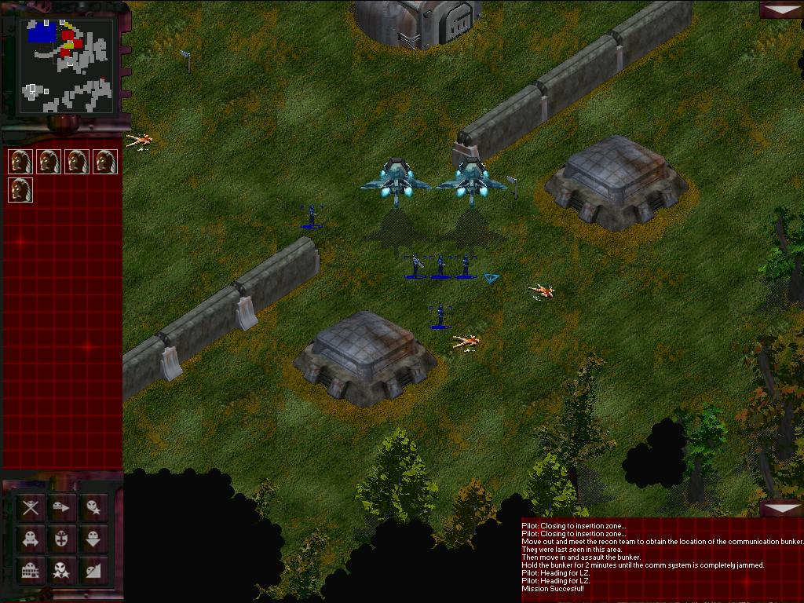 | 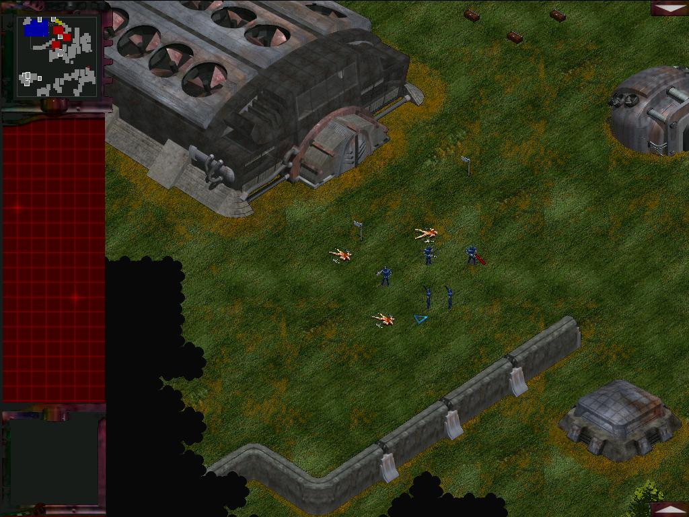 |
|:--:|:--:|
| 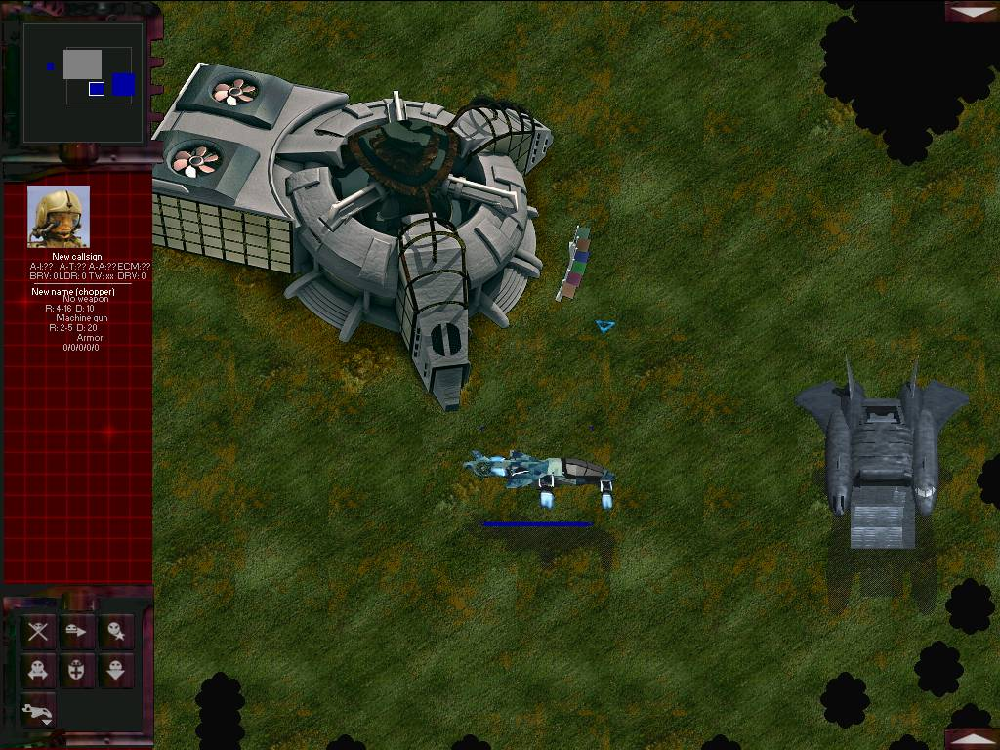 | 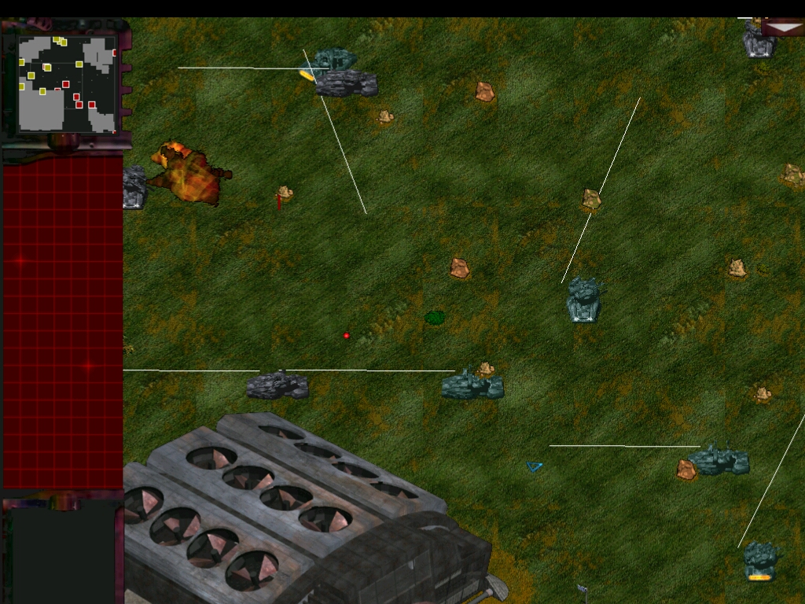 |
| 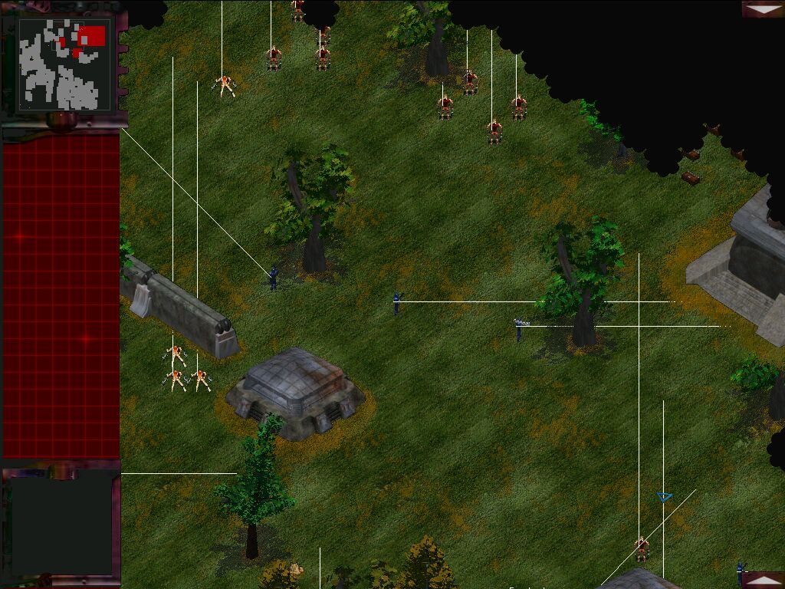 | 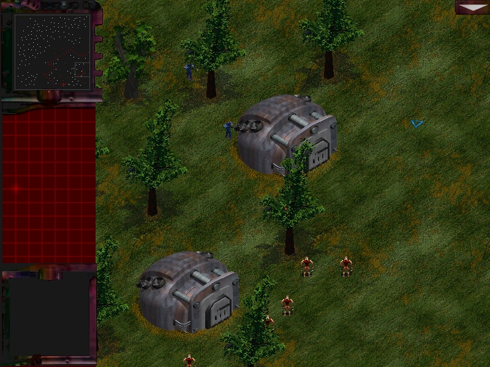 |
| 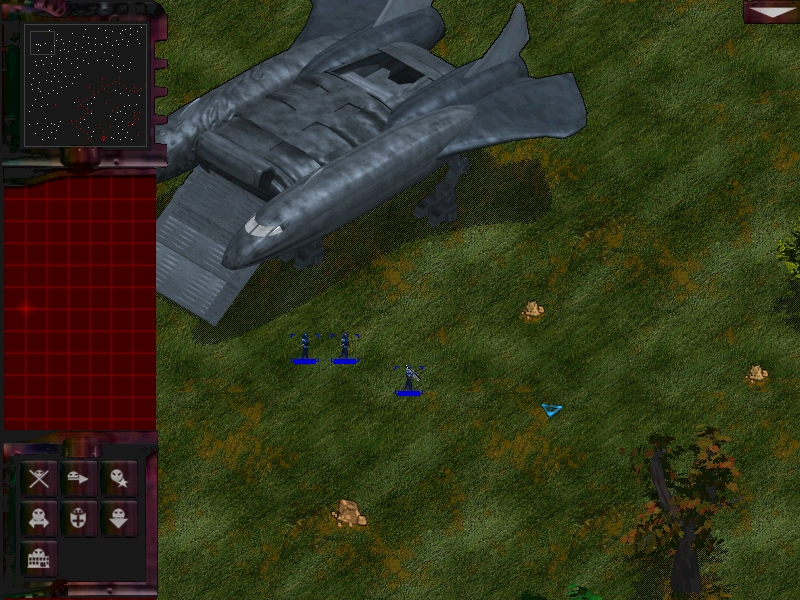 | 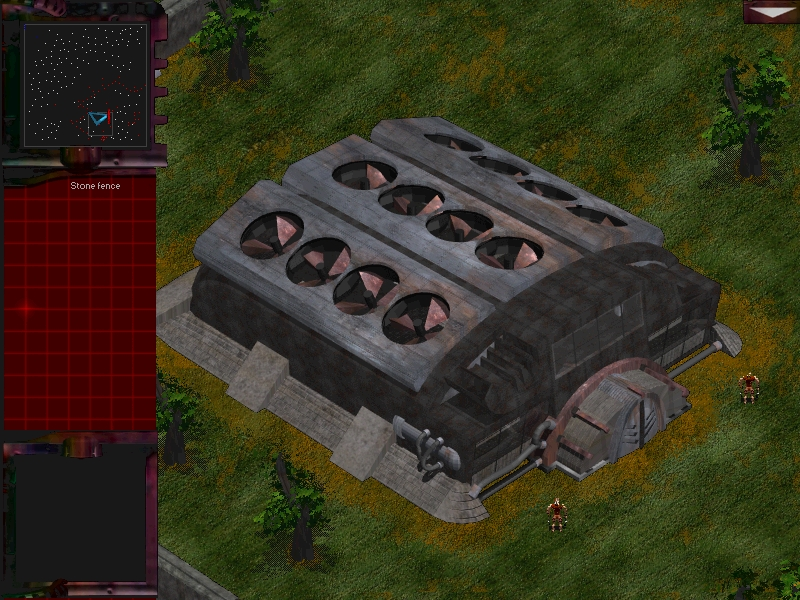 |
| 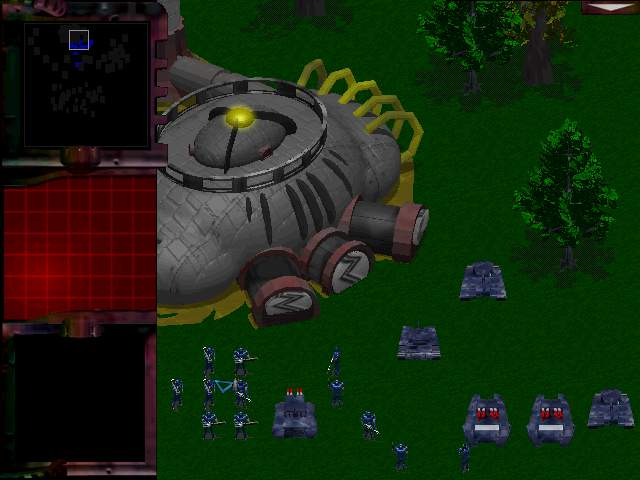 | 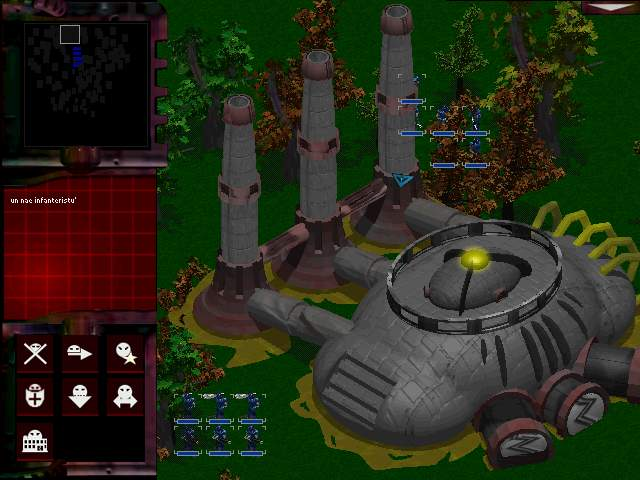 |
| 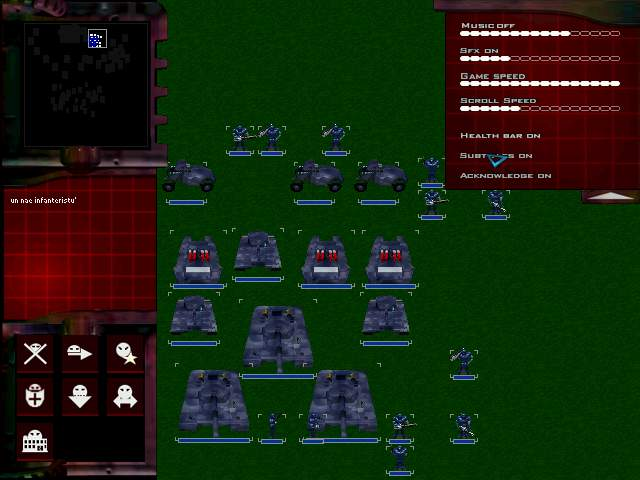 | |

## License

Code is licensed under [LGPL license](https://www.gnu.org/licenses/lgpl-3.0.txt).

Assets are licensed under [Creative Commons Attribution-NonCommercial-ShareAlike](https://creativecommons.org/licenses/by-nc-sa/4.0/).